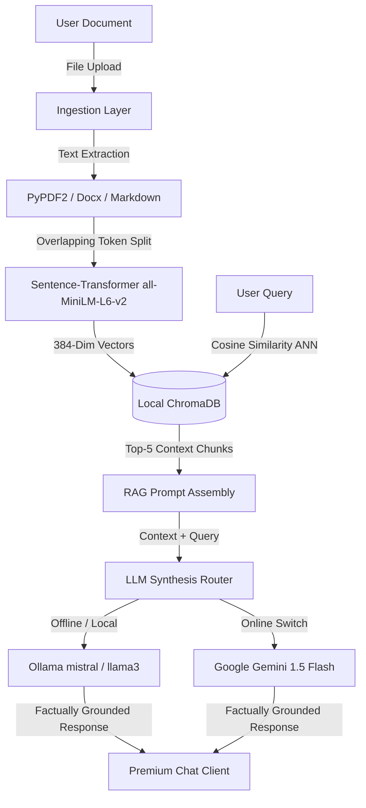

# 🧠 AI-Personal Brain: Private & Local RAG Chat Model

AI-Personal Brain is a premium, high-performance, and completely private **Retrieval-Augmented Generation (RAG)** web application. It runs 100% offline on your own hardware, ensuring absolute data privacy and security — no cloud, no API costs, and zero data leaks. 

The application is styled with a state-of-the-art, high-contrast monochromatic dark/light theme, utilizing smooth CSS floating vector graphics, tactile animated icons, and micro-interactions.

---

## ⚡ Core Features

### 1. 📂 Offline Document Processing & Ingestion
* **Multi-Format Support:** Ingest documents seamlessly including **PDFs (.pdf)**, **Word Documents (.docx)**, **Markdown (.md)**, and **Plain Text (.txt)**.
* **Smart Chunking:** Text is split using overlapping sliding window tokenizers (~500 tokens with a 50-token overlap) to preserve contextual boundaries.
* **Local Embeddings:** Embeds text chunks locally using the `all-MiniLM-L6-v2` Sentence-Transformer model into a 384-dimensional vector space.

### 2. 🗄️ Fully Private Local Vector Database
* **Local Persistence:** Powered by an embedded instance of **ChromaDB** which reads and writes directly to local disk.
* **Mathematical Precision:** Matches user queries against document chunks using high-performance **Cosine Similarity** indexing.
* **Metadata Association:** Every text chunk retains reference coordinates, file sources, and indexing IDs.

### 3. 🤖 Resilient Hybrid Generative Inference
* **Offline Local Synthesis:** Connects to **Ollama** serving highly-efficient quantized LLMs (e.g. *Mistral 7B*, *LLaMA 3*, *Phi-3*).
* **Self-Healing Model Selector:** Dynamically reads active models from your local Ollama runtime, auto-selecting the first available model if the default one is missing.
* **Online Mode (Optional):** Features direct integration with Google's **Gemini-1.5-Flash** when in Online Mode (requires `GEMINI_API_KEY`), with clean fallback to local models if no key exists.

### 4. 🎨 Premium Minimalist Monochromatic UI/UX
* **High-Contrast Dark Mode & Light Mode:** Toggle themes with a responsive switcher. All custom SVG assets dynamically invert color scales natively (crisp white in dark mode, stark black in light mode).
* **Dynamic CSS Backgrounds:** Styled with floating interactive vector paths, slow-spinning switch indicators, periodic security-shake locks, and scale-breathing neural brain indicators.
* **Dynamic Follow-Up Questions:** Programmatically generates relevant context-aware suggestions after every chat based on your query's semantic theme (vectorDB, privacy, summaries, etc.).

---

## 🛠️ System Architecture



---

## 🚀 Quick Start Guide

### Prerequisites
1. **Python 3.9+** installed on your system.
2. **Ollama** installed and running (`ollama serve`).

### 1. Download Local Model
Open your terminal and pull a local model:
```bash
ollama pull mistral
```

### 2. Install Project Dependencies
Navigate to the `backend/` directory and install dependencies:
```bash
pip install -r requirements.txt
```

### 3. Launch the Backend Server
Start the FastAPI server:
```bash
python rag_backend.py
```
The backend automatically starts on `http://localhost:8000` and hosts the static frontend interface.

### 4. Chat & Ingest
1. Open your browser and navigate to `http://localhost:8000`.
2. Click the **attachment icon (📎)** in the chat box to upload your documents.
3. Once processed, type your message. The system will retrieve relevant excerpts from your files and synthesize an offline answer!